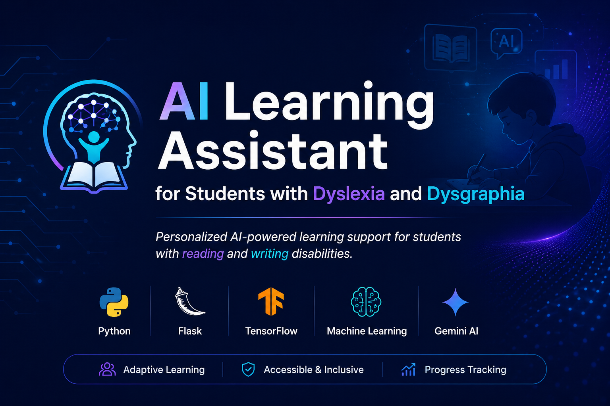
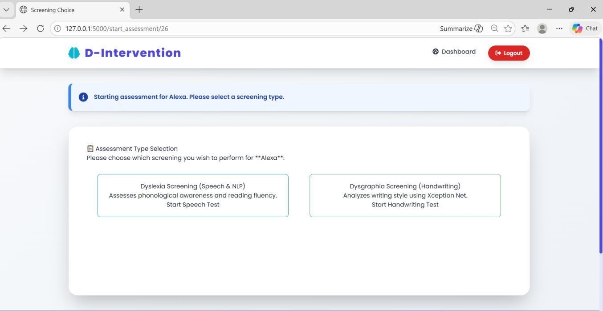
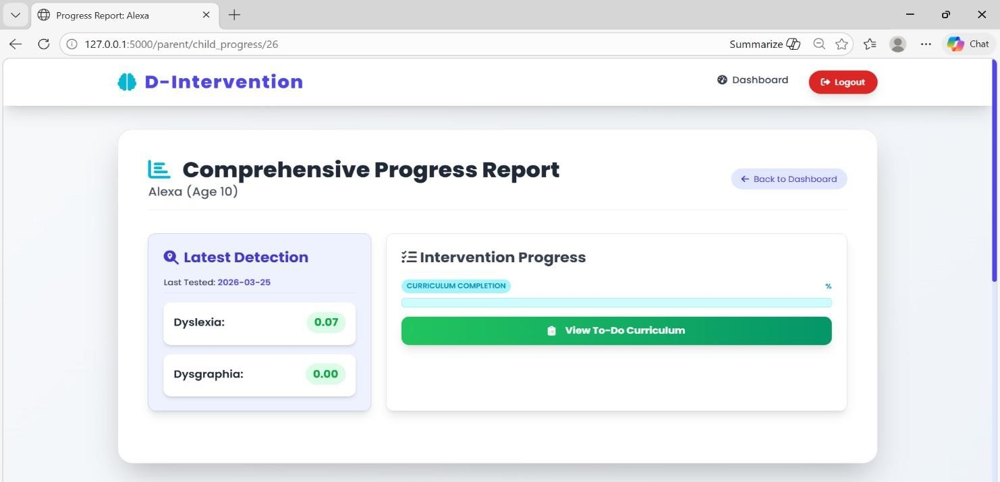
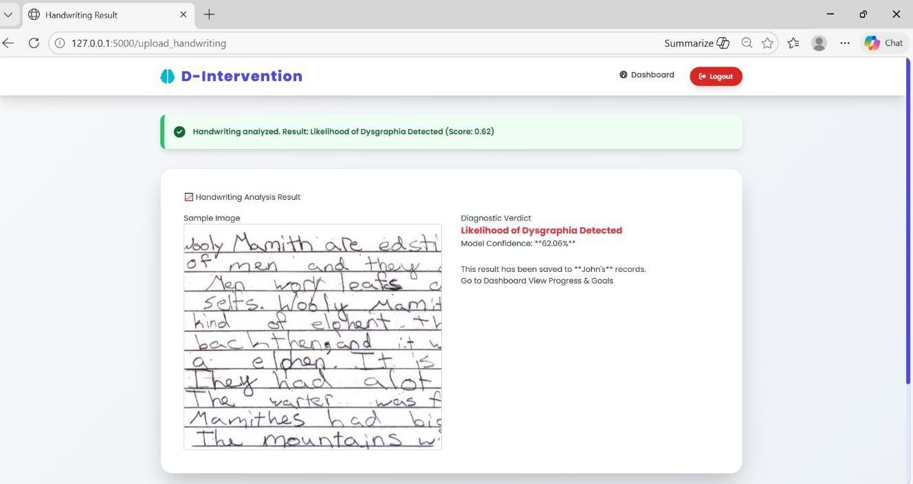
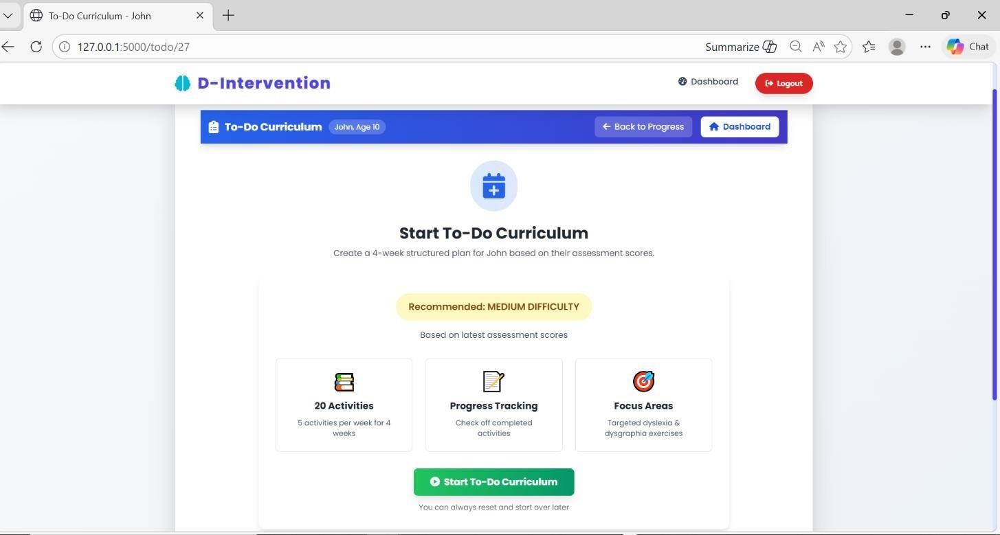
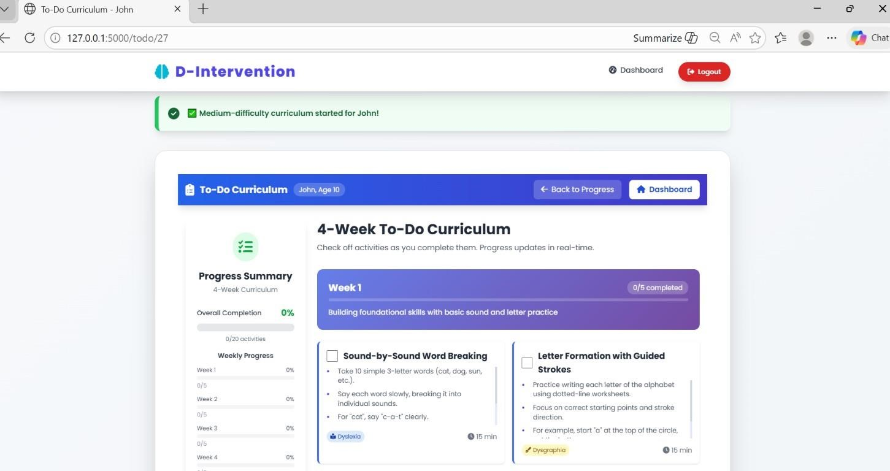

<p align="center">
  
</p>

<h1 align="center">🧠 AI Learning Assistant for Students with Dyslexia and Dysgraphia</h1>

<p align="center">
An AI-powered web application that helps identify learning difficulties through handwriting, speech, and text analysis while providing personalized learning recommendations for students with dyslexia and dysgraphia.
</p>

---

## 📖 About the Project

AI Learning Assistant for Students with Dyslexia and Dysgraphia is an intelligent educational support system developed to assist students who experience difficulties in reading and writing. The application combines Artificial Intelligence, Machine Learning, Natural Language Processing, and Generative AI to analyze different types of user inputs, including handwriting, speech, and text.

Based on the analysis, the system predicts learning difficulties and generates personalized learning recommendations that help students improve their reading and writing skills. The application aims to provide an accessible, interactive, and supportive learning experience for students while assisting educators in understanding individual learning needs.

---

## 🎯 Problem Statement

Students with dyslexia and dysgraphia often face challenges in reading, writing, and language comprehension. Traditional assessment methods require significant manual effort and may not provide personalized guidance for continuous learning.

There is a need for an intelligent system that can assist in identifying learning difficulties at an early stage and provide customized learning recommendations to support students throughout their learning journey.

---

## 💡 Solution

This project uses Artificial Intelligence and Machine Learning techniques to analyze handwriting images, speech, and text inputs. The system predicts possible learning difficulties and generates personalized learning plans using Gemini AI. By combining multiple AI technologies, the application offers a more interactive and adaptive learning experience for students.

---

## ✨ Key Features

- User Registration and Secure Login
- Handwriting Analysis for Dyslexia Detection
- Speech and Text Analysis using Natural Language Processing
- AI-Based Personalized Learning Recommendations
- Student Progress Tracking
- Interactive Dashboard
- Responsive Web Interface
- Adaptive Learning Support using Gemini AI

---

## 🛠️ Tech Stack

### Programming Language
- Python

### Frontend
- HTML5
- CSS3
- JavaScript
- Bootstrap

### Backend
- Flask

### Machine Learning
- TensorFlow
- Keras
- XceptionNet
- Natural Language Processing (NLP)

### Database
- SQLite

### AI Integration
- Gemini AI

### Development Tools
- Visual Studio Code
- Git
- GitHub

---


## 🔄 Project Workflow

```text
Student
      │
      ▼
Login / Register
      │
      ▼
Provide Input
(Text / Speech / Handwriting)
      │
      ▼
Data Preprocessing
      │
      ▼
Machine Learning Models
      │
      ├── NLP Analysis
      ├── Handwriting Analysis
      └── Prediction
      │
      ▼
Gemini AI
      │
      ▼
Personalized Learning Recommendations
      │
      ▼
Student Progress Tracking
```

---

## 📂 Project Structure

```text
AI-Learning-Dyslexia-Dysgraphia
│
├── assets
│   └── banner.png
│
├── screenshots
│   ├── screen-1.png
│   ├── screen-2.png
│   ├── screen-3.png
│   ├── screen-4.png
│   ├── screen-5.png
│   └── screen-6.png
│
├── docs
│   ├── architecture.png
│   └── workflow.png
│
├── static
├── templates
├── services
├── app.py
├── requirements.txt
├── README.md
└── .gitignore
```

---

## 🧠 AI Models Used

### XceptionNet
Used for handwriting image analysis to identify writing patterns associated with dyslexia and dysgraphia.

### Natural Language Processing (NLP)
Processes speech and text inputs to analyze language patterns and improve prediction accuracy.

### Gemini AI
Generates personalized learning recommendations based on the prediction results and student performance.

---

## 📸 Application Screenshots

### Home Page

<p align="center">

</p>

---

### Login Page

<p align="center">

</p>

---

### Dashboard

<p align="center">

</p>

---

### Handwriting Analysis

<p align="center">

</p>

---

### Personalized Learning Recommendation

<p align="center">

</p>

---

### Student Progress

<p align="center">

</p>

---

## ⚙️ Installation

Clone the repository

```bash
git clone https://github.com/Tejasree2305/AI-Learning-Dyslexia-Dysgraphia.git
```

Move to the project directory

```bash
cd AI-Learning-Dyslexia-Dysgraphia
```

Install the required dependencies

```bash
pip install -r requirements.txt
```

Run the application

```bash
python app.py
```

Open your browser and visit

```text
http://127.0.0.1:5000
```

---

## ▶️ How to Use

1. Register a new account or log in.
2. Upload handwriting samples or provide speech/text input.
3. Allow the AI model to analyze the provided data.
4. View the prediction results.
5. Receive personalized learning recommendations generated by Gemini AI.
6. Track learning progress through the dashboard.

---

## 🚀 Future Enhancements

- Mobile Application Support
- Multi-language Learning Assistance
- Cloud Deployment
- Teacher Dashboard
- Parent Dashboard
- Advanced Deep Learning Models
- Real-time Voice Assistant
- Learning Progress Analytics

---

## 📚 Applications

- Schools
- Special Education Centers
- Learning Support Programs
- Educational Research
- Personalized Learning Platforms

---

## 🤝 Contributing

Contributions are welcome. If you would like to improve this project, feel free to fork the repository, make your changes, and submit a pull request.

---

## 📄 License

This project is developed for educational and academic purposes.

---

## 👩‍💻 Author

**Teja Sree**

Computer Science Engineering Student

Interests:
- Artificial Intelligence
- Machine Learning
- Python Development
- Deep Learning
- Natural Language Processing

GitHub:
https://github.com/Tejasree2305

LinkedIn:
https://www.linkedin.com/in/m-tejasree-183b2525b

Email:
mtejasree23@gmail.com

---

## ⭐ Support

If you found this project useful, consider giving it a ⭐ on GitHub. Your support helps increase the visibility of the project and encourages further improvements.
